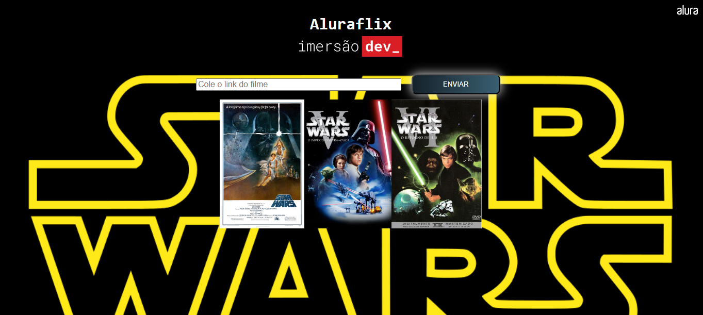

<h1 align="center"> AluraFlix - Alura's Immersion Dev 7 💵💰 </h1>

# 📃 About 
The Alura Flix project aims to create a catalog of movie posters and was developed during Alura's Dev Immersion 7. Among the implemented enhancements, I changed the looping structure to use a forEach method. Additionally, I added a field on the page where users can input a link to a new poster, which is then displayed on the screen.

# 🔍 Live test 
Feel free to test the converter by clicking this [link](https://evertonab28.github.io/aluraFlix/)

# 💻 View of interface

  

# 🔗 Technologies
☑️ HTML and CSS
☑️ JavaScript